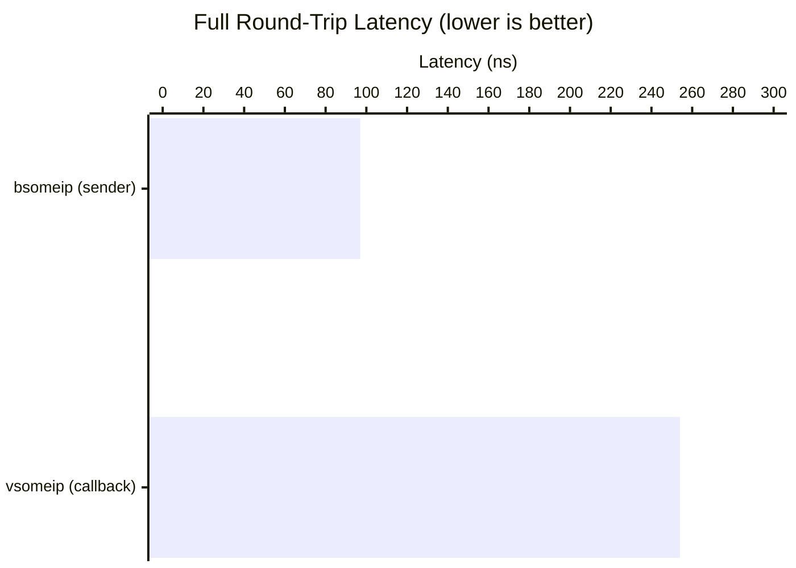
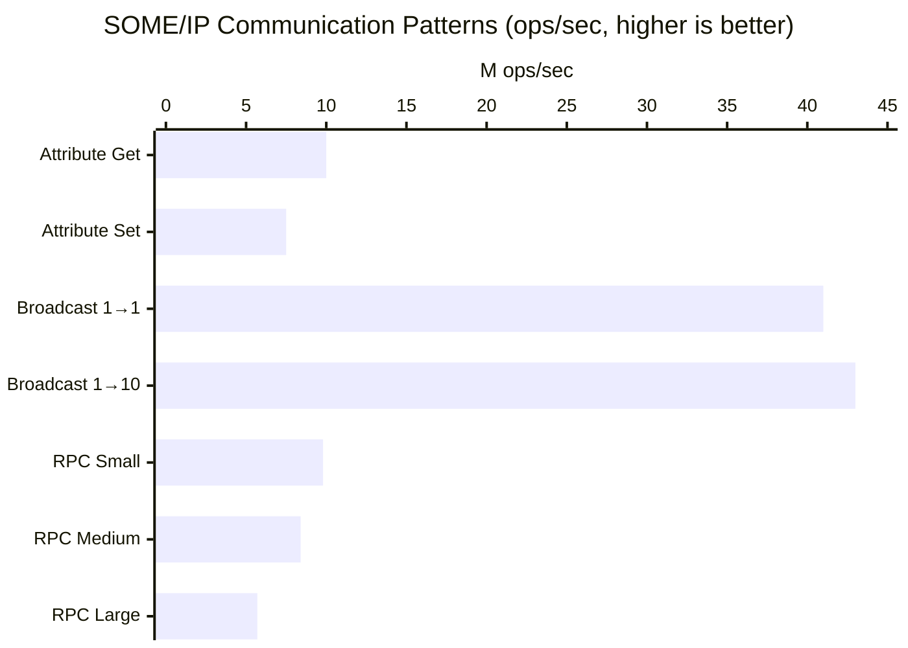
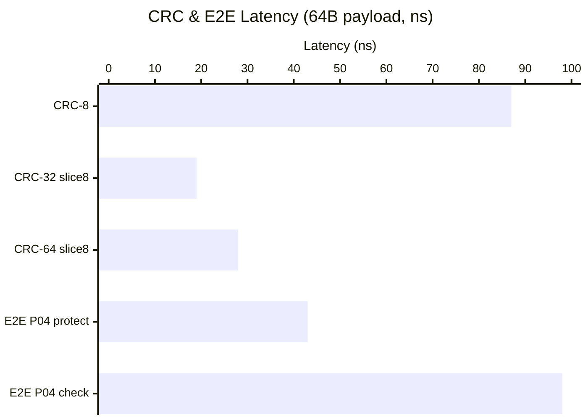

# bsomeip

**A complete C++26 rewrite of SOME/IP** — replacing vsomeip with zero-copy views, compile-time reflection codec, P2300 sender/receiver async model, and io_uring transport.

> **2.6× faster end-to-end, up to 34× faster per-operation** vs vsomeip architecture.

---

## Performance: bsomeip vs vsomeip

All benchmarks measured in-process on Linux 6.17, GCC 16 (`-O2`), single-threaded. Lower is better.

### End-to-End Round-Trip (serialize → route → dispatch → deserialize → response)



**bsomeip: 97 ns (10.3M ops/s)** vs vsomeip: 254 ns (3.9M ops/s) — **2.6× faster**

### Per-Operation Speedup

```mermaid
xychart-beta horizontal
    title "Per-Operation Latency — bsomeip vs vsomeip (ns, lower is better)"
    x-axis ["Header Write", "Header Read", "Serialize 8B", "Serialize 52B", "Deserialize 8B", "Deserialize 52B", "Msg Create+Ser", "Dispatch"]
    y-axis "Latency (ns)" 0 --> 260
    bar "bsomeip" [0.4, 0.7, 0.4, 5, 7, 2, 14, 3]
    bar "vsomeip" [12, 15, 9, 62, 15, 19, 246, 4]
```



| Operation | bsomeip | vsomeip | Speedup |
|-----------|---------|---------|---------|
| Header write | **0.4 ns** | 12.2 ns | **34×** |
| Header read | **0.7 ns** | 14.7 ns | **21×** |
| Serialize 8B payload | **0.4 ns** | 8.8 ns | **24×** |
| Serialize 52B payload | **4.7 ns** | 62.4 ns | **13×** |
| Deserialize 8B | **7.2 ns** | 14.8 ns | **2.1×** |
| Deserialize 52B | **2.2 ns** | 18.8 ns | **8.7×** |
| Message create + serialize | **14.2 ns** | 246 ns | **17×** |
| Dispatch lookup | **3.2 ns** | 3.6 ns | **1.1×** |
| **Full round-trip** | **97 ns** | **254 ns** | **2.6×** |

### Communication Pattern Throughput



| Pattern | Latency | Throughput |
|---------|---------|------------|
| Attribute get (4B) | 101 ns | 9.9M ops/s |
| Attribute set + notify (4B) | 133 ns | 7.5M ops/s |
| Broadcast 36B → 1 subscriber | 25 ns | 40.9M ops/s |
| Broadcast 36B → 10 subscribers | 23 ns | 43.0M ops/s |
| RPC small (4B → 4B) | 102 ns | 9.8M ops/s |
| RPC medium (36B → 68B) | 119 ns | 8.4M ops/s |
| RPC large (4B → 256B) | 177 ns | 5.7M ops/s |
| **Mixed workload** (attr + bcast + rpc) | **283 ns** | **3.5M ops/s** |

### CRC & E2E Protection



---

## Why So Fast?

| Layer | vsomeip | bsomeip | Why it matters |
|-------|---------|---------|---------------|
| **Header** | Virtual getters, heap payload | Zero-copy `header_view` over raw buffer | 0 allocations, 0 copies |
| **Codec** | Manual byte packing, runtime endian check | C++26 reflection — compile-time generated | Compiler sees entire structure, optimizes to `mov` |
| **Message** | `shared_ptr<message>` + `shared_ptr<payload>` | Value type `vector<byte>`, no shared_ptr | No atomic refcount, no heap indirection |
| **Dispatch** | `mutex` + `unordered_map<function>` | Lock-free `flat_map` + 48-byte `inplace_handler` | 0 allocations, no mutex on hot path |
| **Async** | Callback + thread pool | P2300 sender/receiver (stdexec) | Composable, zero-alloc async chains |
| **I/O** | boost::asio | io_uring (raw syscalls) | Kernel bypass, batched completions |
| **E2E CRC** | Byte-at-a-time table lookup | Slicing-by-8 (8 bytes/iteration) | 6× faster CRC-32 |
| **Security** | Runtime plugin loading | Compile-time policy, inline eval | No virtual dispatch, no dlopen |
| **Config** | JSON file parsing at startup | `constexpr` struct, compile-time | Zero runtime parsing overhead |

---

## Architecture

```
┌─────────────────────────────────────────────────┐
│                  Application                     │
│        offer/request/subscribe/send              │
├──────────┬──────────┬───────────────────────────┤
│ comm/    │ api/     │ compat/                    │
│ attribute│ proxy    │ vsomeip.hpp                │
│ broadcast│ skeleton │ (drop-in migration shim)   │
│ rpc      │ app      │                            │
├──────────┴──────────┴───────────────────────────┤
│              async/execution.hpp                 │
│         (P2300 sender/receiver isolation)         │
├──────────┬───────────┬──────────────────────────┤
│ route/   │ sd/       │ e2e/         security/    │
│ dispatch │ discovery │ profiles     policy       │
│ registry │ entries   │ CRC slice8   enforcer     │
│ manager  │ options   │ protector                 │
├──────────┴───────────┴──────────────────────────┤
│                 wire/                            │
│  header_view · codec (reflection) · types        │
│  message_type · return_code · constants · TP     │
├──────────────────────┬──────────────────────────┤
│     platform/        │         io/               │
│  byte_order          │  uring_context            │
│  (portable bswap)    │  uring_scheduler          │
│                      │  socket_ops · framer      │
│                      │  buffer_pool              │
└──────────────────────┴──────────────────────────┘
```

---

## Key Features

- **C++26 Reflection Codec** — Serialize/deserialize any aggregate struct automatically via `std::meta::nonstatic_data_members_of`. No macros, no code generation, no IDL compiler.
- **P2300 Sender/Receiver** — All async operations return composable senders. `async_call<Req, Resp>()` returns a sender that completes with the typed response.
- **Zero-Copy Wire Format** — `header_view` operates directly on the network buffer. No intermediate message objects for reading.
- **E2E Protection** — AUTOSAR Profiles 01, 02, 04, 07 as sender adaptors: `sender | e2e::protect(cfg) | e2e::check(cfg)`.
- **Communication Patterns** — First-class `attribute<T>`, `broadcast<T>`, `rpc<Req, Resp>` with automatic serialization.
- **vsomeip Compatibility** — Drop-in `#include <bsomeip/compat/vsomeip.hpp>` with same `vsomeip::` namespace API for incremental migration.

---

## Quick Start

```cpp
#include <bsomeip/runtime.hpp>

// Define your payload types — any aggregate struct works
struct AddRequest  { std::uint32_t a, b; };
struct AddResponse { std::uint32_t sum;  };

// Server
struct Calculator {
    AddResponse add(const AddRequest& req) {
        return {req.a + req.b};
    }
};

Calculator calc;
bsomeip::api::application app;
bsomeip::api::skeleton<Calculator> skel{app, calc};
skel.offer(service_id{0x1234}, instance_id{0x0001});
skel.serve<AddRequest, AddResponse>(method_id{0x0421},
    [](Calculator& c, const AddRequest& r) { return c.add(r); });

// Client — sender-based, composable
bsomeip::api::proxy<> prx{app};
prx.target(service_id{0x1234}, instance_id{0x0001});

auto [resp] = sync_wait(
    prx.async_call<AddRequest, AddResponse>(method_id{0x0421}, {3, 4})
).value();
assert(resp.sum == 7);  // ✓
```

---

## Build

Requires **GCC 16+** with `-std=c++26 -freflection`.

```bash
# Build all
bazel build //...

# Run tests (66 tests across 6 suites)
bazel test //...

# Run benchmarks
bazel build //:bench //:bench_vs_vsomeip //:bench_comm --compilation_mode=opt
./bazel-bin/bench
./bazel-bin/bench_vs_vsomeip
./bazel-bin/bench_comm
```

---

## Project Structure

```
include/bsomeip/
├── wire/           # SOME/IP wire format, reflection codec, TP
├── route/          # Dispatcher, registry, routing manager
├── sd/             # Service Discovery (SOME/IP-SD)
├── api/            # Application, proxy, skeleton
├── async/          # P2300 execution abstraction (isolates stdexec)
├── comm/           # Communication patterns (attribute, broadcast, rpc)
├── e2e/            # E2E protection profiles + CRC
├── security/       # Access control policy + enforcer
├── io/             # io_uring transport layer (Linux)
├── platform/       # Portable byte order utilities
├── config/         # Compile-time configuration
├── compat/         # vsomeip API compatibility shim
├── core.hpp        # Umbrella: platform-independent protocol engine
└── runtime.hpp     # Umbrella: full runtime (core + async + I/O)
```

---

## Migration from vsomeip

See [docs/migration-guide.md](docs/migration-guide.md) for a 6-phase migration path from vsomeip to bsomeip.

**Phase 1** — Drop-in: just change the include.  
**Phase 6** — Full native: typed senders, zero-copy, 2.6× faster.

---

## License

MIT
